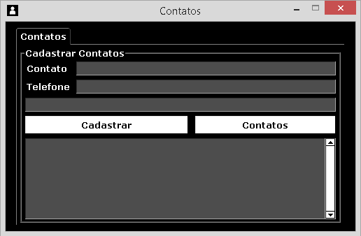
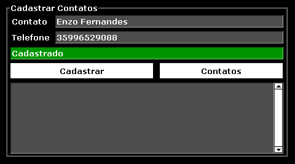
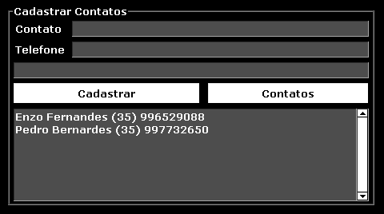

# Contatos

Este repositório contém um cadastro de contatos desenvolvido em `Python`. O programa proporciona que o usuário cadastre contatos e telefones, guardando os dados em um arquivo de texto, criado automaticamente, para uso futuro.

## Uso

**Nota:** O programa está empacotado como um arquivo executável. Portanto, você não precisa instalar nada no seu computador.

1. Faça o `Download` deste repositório.
2. Dentro da pasta `Programa`, execute o arquivo `Contatos.exe`.

## Funções

### Cadastrar Contato

**Nota:** Os contatos são salvos no arquivo `Contatos.txt`, que é automaticamente criado assim que o programa é executado, preservando as informações entre as execuções.

1. Preencha os campos necessários e pressione o botão `Cadastrar`.
2. O retorno pode apresentar os seguintes resultados:
    - **Cadastrado:** Se os dados fornecidos atenderem aos requisitos. Nesse caso, o contato será cadastrado.
    - **Dados Incorretos:** Se os dados fornecidos não atenderem aos requisitos. Nesse caso, o contato não será cadastrado.
      

### Mostrar Contatos

1. Pressione o botão `Contatos`.
2. Os contatos cadastrados aparecerão no campo correspondente.

## Licença

**[MIT License](LICENSE.md)**
